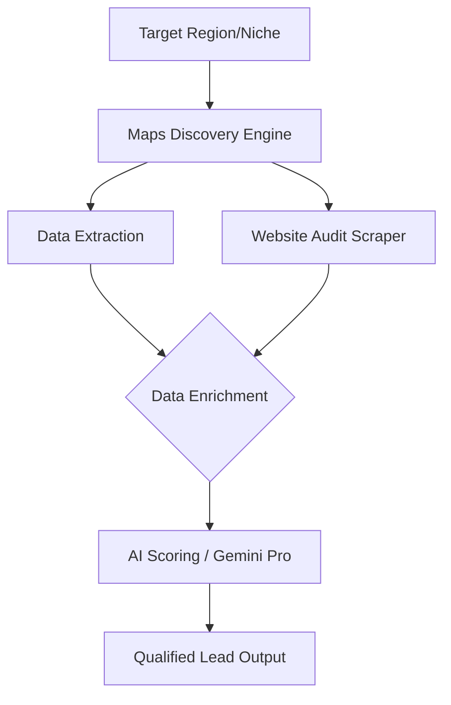

# 🗺️ Klier-Scout

Automated data pipeline for massive business discovery and digital auditing. A core engine inside the **KlierNav Innovations** lead acquisition ecosystem.

Identifies target businesses on Google Maps, extracts metadata, and performs initial "digital health" audits — feeding qualified leads directly into the CRM pipeline.

---

## ⚙️ How it Works

## ⚡ Features

- **Massive Discovery:** Crawls business listings with high precision and rate-limiting handling.
- **Metadata Extraction:** Grabs social links, SEO health indicators, and contact points.
- **Enrichment Pipeline:** Ready to pipe data into LLMs for scoring and categorization.
- **Multi-Output support:** JSON, CSV, or direct CRM injection.

---

## 🛠️ Stack

- **Core:** Node.js / TypeScript / Python
- **Scraping:** Puppeteer / Playwright
- **AI Integration:** Gemini Pro / OpenAI

---

*Engineered by [KlierNav Innovations](https://www.kliernav.com).*

---

🇦🇷 Versión en Español

## 🗺️ Klier-Scout & Motor de Datos

Pipeline técnico de extracción masiva de datos para descubrimiento de negocios y auditoría digital. Motor central del ecosistema de adquisición de leads de **KlierNav Innovations**.

Automatiza la identificación de negocios en Google Maps, extrae metadatos y realiza auditorías iniciales de "salud digital".

### 🛠️ Características
- **Descubrimiento Masivo:** Rastreo de listados de negocios con alta precisión y manejo de rate-limiting.
- **Extracción de Metadatos:** Captura links de redes sociales, indicadores de SEO y puntos de contacto.
- **Pipeline de Enriquecimiento:** Preparado para inyectar datos en LLMs para scoring y categorización.
- **Multi-Output:** JSON, CSV o inyección directa a CRM.

### 🛠️ Stack
- **Core:** Node.js / TypeScript / Python
- **Scraping:** Puppeteer / Playwright
- **IA:** Gemini Pro / OpenAI

