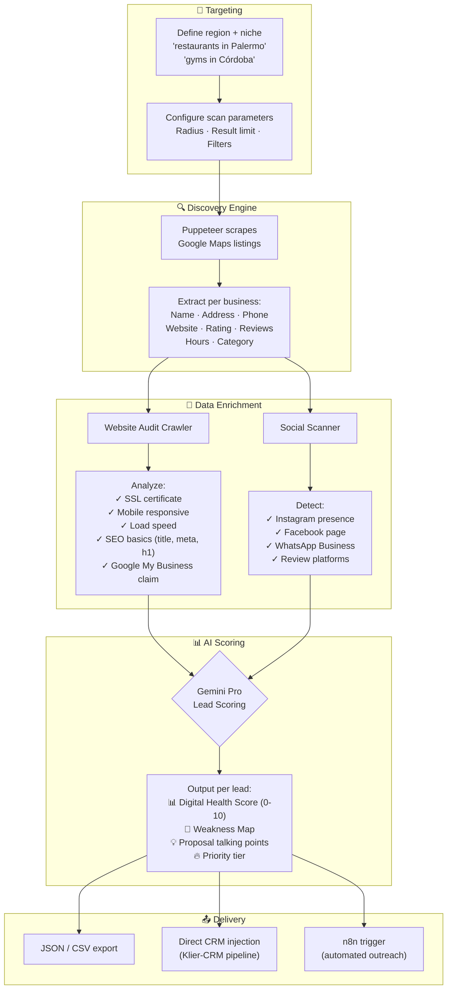

# 🗺️ Klier-Scout


> **Automated intelligence engine** that discovers businesses on Google Maps, extracts their digital footprint, and scores them for sales readiness — turning raw map data into qualified pipeline fuel.

---

## 💡 Why Klier-Scout?

Cold outreach without data is spam. Cold outreach **with precision data** is consulting. Klier-Scout bridges that gap: instead of buying stale lead lists, it generates **fresh, enriched business profiles** on demand for any niche and geography — complete with website health audits, social presence checks, and an AI-generated readiness score.

**The difference:** A traditional lead list gives you a name and phone number. Klier-Scout gives you a name, phone, email, website, Google rating, review count, social links, SEO health score, mobile responsiveness status, and a personalized weakness map. **That's the data that closes deals.**

---

## ⚙️ How It Works



---

## ⚡ Key Capabilities

| Capability | Details |
| :--- | :--- |
| 🌍 **Geo-Targeted Discovery** | Define any region on Google Maps + business category. Handles pagination, rate-limiting, and captcha-avoidance automatically. |
| 🕷️ **Deep Metadata Extraction** | Beyond basic listings: extracts websites, socials, review sentiment signals, operational hours, and category tags. |
| 🔬 **Website Health Audit** | Crawls each business's website to check SSL, mobile responsiveness, page speed, SEO fundamentals, and tech stack detection. |
| 🤖 **AI Lead Scoring** | Feeds enriched profiles into Gemini Pro with a structured prompt. Returns a 0–10 score + actionable weakness analysis for sales conversations. |
| 📤 **Multi-Output Formats** | Export as JSON, CSV, or inject directly into Klier-CRM's pipeline via API. Also triggers n8n workflows for automated outreach sequences. |
| 🛡️ **Ethical Scraping** | Configurable rate limits, request delays, and user-agent rotation. Respects `robots.txt` and avoids aggressive patterns. |

---

## 🛠️ Tech Stack

| Layer | Technology |
| :--- | :--- |
| **Scraping Runtime** | Node.js + Puppeteer (headless Chrome) |
| **Data Processing** | TypeScript + Python scripts |
| **AI Integration** | Gemini Pro / OpenAI for scoring |
| **Output** | JSON, CSV, REST API, n8n webhooks |

---

## 🚀 Quick Start

```bash
git clone https://github.com/SerjCallier/klier-scout.git
cd klier-scout
npm install

# Run a discovery (example: restaurants in Buenos Aires)
node src/index.js --query "restaurants" --location "Buenos Aires" --limit 50
```

---

<p align="center">
  <i>Engineered by <a href="https://www.kliernav.com"><b>KlierNav Innovations</b></a> — AI-First Digital Agency</i>
</p>

---

<details>
<summary>🇦🇷 Versión en Español</summary>

## 🗺️ Klier-Scout

> **Motor de inteligencia automatizado** que descubre negocios en Google Maps, extrae su huella digital y los califica por preparación de compra — convirtiendo datos crudos de mapas en combustible de pipeline calificado.

### 💡 ¿Por qué Klier-Scout?

Contacto frío sin datos es spam. Contacto frío **con datos de precisión** es consultoría. Klier-Scout genera **perfiles de negocios frescos y enriquecidos** on-demand para cualquier nicho y geografía — con auditorías web, detección de redes sociales y un score de readiness generado por IA.

**La diferencia:** Una lista de leads tradicional te da nombre y teléfono. Klier-Scout te da nombre, teléfono, email, web, rating Google, conteo de reviews, redes sociales, score de salud SEO, estado de responsividad móvil y un mapa de debilidades personalizado.

### ⚡ Capacidades
| Capacidad | Detalles |
| :--- | :--- |
| 🌍 **Descubrimiento Geo-Targeted** | Cualquier región de Google Maps + categoría. Maneja paginación y rate-limiting automáticamente. |
| 🕷️ **Extracción Profunda** | Websites, redes, sentimiento de reviews, horarios, tags de categoría. |
| 🔬 **Auditoría Web** | SSL, mobile, velocidad, SEO fundamentals, detección de tech stack. |
| 🤖 **Scoring IA** | Gemini Pro califica cada perfil y genera análisis de debilidades accionable. |
| 📤 **Multi-Output** | JSON, CSV, inyección directa a CRM, o trigger de n8n. |

### 🛠️ Stack
- **Scraping:** Node.js + Puppeteer
- **Procesamiento:** TypeScript + Python
- **IA:** Gemini Pro / OpenAI
- **Output:** JSON, CSV, API REST, n8n webhooks

</details>
